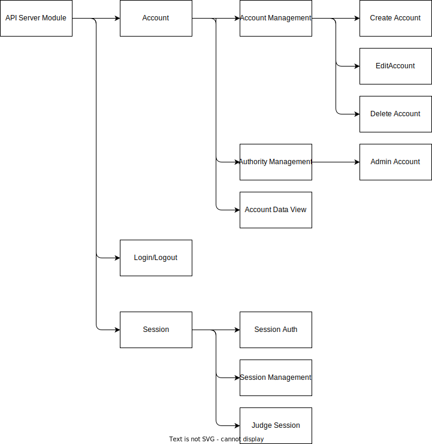

# 基本設計書

## システムブロック図

## 機能一覧

### アカウント作成機能

- 概要: ユーザが新しいアカウントを作成できるようにします。
- 入力: ユーザがID（任意の文字列）とパスワードを入力します。
- 出力: アカウントが作成され、認証情報が保存されます。また、登録アカウント数がゼロの場合は必ず管理者権限が付与されます。

### アカウント削除機能

- 概要: ユーザまたは管理者がアカウントを削除できるようにします。
- 入力: アカウントを選択します。
- 出力: アカウントが削除されます。

### アカウント編集機能

- 概要: ユーザがアカウント情報を変更できるようにします。
- 入力: アカウントの修正したい情報を入力します。
- 出力: 登録されているデータが編集されます。

### アカウントデータ閲覧機能

- 概要: アカウントデータを取得します。
- 入力: アカウントidを入力します。
- 出力: 登録されているアカウントデータを読みだして返却します。

### 管理者権限管理

- 概要: 各アカウントの管理者権限の有無を管理します。
- 入力: 管理者権限の設定・変更リクエストが行われます。
- 出力: 権限の設定・変更が反映されます。

### ログイン/ログアウト機能

- 概要: ユーザが既存のアカウントでログイン/ログアウトできるようにします。
- 入力: ユーザがIDとパスワードを入力します。
- 出力: 認証が成功した場合、セッションが開始されます。

### セッション認証

- 概要: ログイン時にセッション認証を行い、セッションを管理します。
- 入力: ログイン情報（IDとパスワード）が提供されます。
- 出力: 認証が成功した場合、セッションが生成され、クッキーに保存されます。

### セッション管理

- 概要: サーバ内のDBを使用してセッションを管理します。
- 入力: セッションに関する操作リクエストが行われます。
- 出力: セッション情報がDBに保存・更新されます。

### 認証状態判定機能

- 概要: ユーザは現在の認証状態を判定する機能を利用できます。
- 入力: 認証状態の判定がリクエストされます。
- 出力: 認証済みかどうかが応答されます。